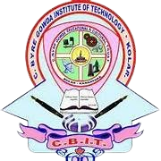

<p align="center">
  
</p>

<h1 align="center">Automated Faculty Evaluation System</h1>

<p align="center">
  <b>C. Byregowda Institute of Technology</b><br/>
  Department of Computer Science & Engineering<br/>
  <i>Initiated under the guidance of HOD — Dr. Vasudev R</i>
</p>

<p align="center">
  A full-stack web application for collecting and managing anonymous student feedback on faculty members.<br/>
  Developed by the <b>Club of Programmers (COPS)</b>.
</p>

---

## Welcome, Club Members!

We're excited to have you here! This project is open for contributions from all COPS members. Whether you're fixing bugs, adding features, improving UI, or writing documentation — every contribution matters.

### How to Contribute

1. **Fork** this repository
2. **Clone** your fork locally
3. Create a new **branch** for your feature/fix
   ```bash
   git checkout -b feature/your-feature-name
   ```
4. Make your changes and **commit**
   ```bash
   git commit -m "Add: brief description of your change"
   ```
5. **Push** to your fork and open a **Pull Request**
   ```bash
   git push origin feature/your-feature-name
   ```

---

## Tech Stack

| Layer    | Technology                          |
| -------- | ----------------------------------- |
| Frontend | React 18 + Vite + Tailwind CSS 3   |
| Backend  | FastAPI + SQLAlchemy                |
| Database | PostgreSQL (Supabase)               |
| Hosting  | Vercel (frontend) + Render (backend)|

## Features

- Student registration with anti-misuse protection (registration gate + secret code)
- Anonymous feedback submission with 5-point rating scale
- Admin dashboard with statistics and reports
- Batch, Section, and Teacher CRUD management
- Section-Teacher mapping
- CSV report download
- Semester reset functionality
- IP-based rate limiting
- JWT authentication

## Getting Started (Local Development)

### Prerequisites

- Python 3.11+
- Node.js 18+
- PostgreSQL database (or Supabase account)

### Backend Setup

```bash
cd backend
python -m venv ../.venv
../.venv/Scripts/activate    # Windows
# source ../.venv/bin/activate  # macOS/Linux
pip install -r requirements.txt
```

Create a `.env` file in the project root (refer to `.env.example`):

```env
DATABASE_URL=your_database_url
SECRET_KEY=your_random_secret_key
ADMIN_USERNAME=admin
ADMIN_PASSWORD=your_admin_password
```

Run the backend:

```bash
cd backend
uvicorn main:app --reload --port 8000
```

### Frontend Setup

```bash
cd frontend
npm install
npm run dev
```

The app will be available at `http://localhost:5173`.

## Project Structure

```
Feedback_tech/
├── backend/
│   ├── main.py            # FastAPI app & all endpoints
│   ├── models.py          # SQLAlchemy ORM models
│   ├── schemas.py         # Pydantic request/response models
│   ├── database.py        # Database connection & session
│   ├── auth.py            # JWT authentication helpers
│   └── requirements.txt   # Python dependencies
├── frontend/
│   ├── src/
│   │   ├── api.js         # Axios API client
│   │   ├── pages/         # React page components
│   │   └── App.jsx        # Router & app shell
│   ├── public/            # Static assets
│   ├── vercel.json        # Vercel deployment config
│   ├── netlify.toml       # Netlify deployment config
│   └── package.json       # Node dependencies
├── .env.example           # Environment variable template
├── .gitignore
└── README.md
```

---

## Project Initiated By

| | |
| --- | --- |
| **College** | C. Byregowda Institute of Technology |
| **Department** | Computer Science & Engineering |
| **HOD** | Dr. Vasudev R |

## Developers

| Name              | Role        |
| ----------------- | ----------- |
| **Bhanu Kiran R** | Developer   |
| **Deepak PS**     | Developer   |

## Contributors

We welcome contributions from all COPS members! See the [How to Contribute](#how-to-contribute) section above to get started.

---

## License

This project is maintained by the **Department of CSE, C. Byregowda Institute of Technology** in collaboration with the **Club of Programmers (COPS)**. All rights reserved.
